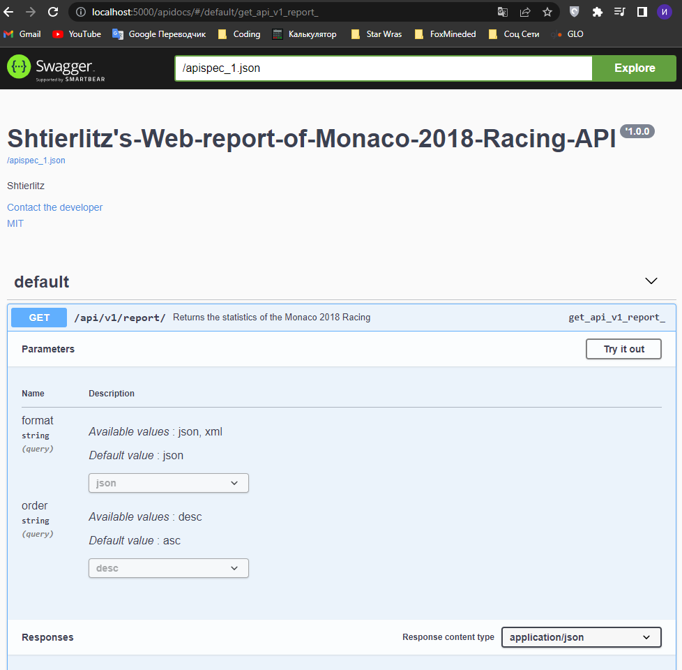

# Web report of Monaco 2018 Racing + API

## Description
A training project written in the Flask framework for creating a web report on the races in 2018 Monaco  
with the addition of a small API interface.

## Technologies used
`Python`, `Flask`, `REST`, `Peewee`, `argparse`, `sqlite3`, `Flasgger/Swagger_ui`, `pytest`

## Getting started

To make it easy for you to get started with web report, 
here's a list of recommended next steps.

## Download
Download the repository with this command: 
```bash
git clone https://github.com/Shtierlitz/Web-report-of-Monaco-2018-Racing.git
```
## Create Files
For the local server to work correctly, create your own file `local_settings.py` 
and place it in a folder next to the file `settings.py` of this Flask project.
You will also need to create `.env` file and place it in the root of the project.

### Required contents of the local_settings.py file:
```python
# project/local_settings.py

import os

SECRET_KEY = os.environ.get('SECRET_KEY')
DEBUG = True
FOLDER_PATH = '../project/static/data'
BASE_DIR = os.path.dirname(os.path.abspath("app.py"))
DATA_DIR = os.path.join(BASE_DIR, 'static', 'data')
DATA_BASE = "racers.db"
```

### Required contents of the .env file:
```python
SECRET_KEY='<your SECRET key>'
```

# Localhost development (only)

## Flask run
### Preparations
Before using the app you need to create sqlite3 database and generate data.
Go to the `project/` folder and use command:
```bash
python db_create_script.py --db_path 'racers.db' --folder_path '../project/static/data' 
```

### Venv
You need to create a virtual environment and install all dependencies  

To create virtual environment go to the root directory and run:
```bash
python -m venv venv
```

Run virtual environment:
```bash
venv/scripts/activate
```

After you can install dependencies:
```bash
pip install -r requirements.txt
```

### Run app
To run localhost server just get to the `project/` folder and then run the command:
```bash
flask run
```
http://127.0.0.1:5000/report/ - report  
http://127.0.0.1:5000/report/drivers/ - list of drivers  
http://127.0.0.1:5000/report/drivers/ <driver code> - individual driver results


## Test 

## Create Files
For the tests to work correctly, create your own file `testing_settings.py` 
and place it in a folder next to the file `settings.py` of this Flask project.

### Required contents of the testing_settings.py file:
```python
# project/testing_settings.py
import os

DATA_BASE = ':memory:'
BASE_DIR = os.path.dirname(os.path.abspath(__file__))
DATA_DIR = os.path.join(BASE_DIR, 'static', 'data')
```


To run tests from the localhost you need to return into root directory and run:  
```bash
pytest tests\test.py
````
## Api 
### You can follow the following paths to use the `API`:
After running `flask run` you can choose two links to use swagger:
http://localhost:5000/apidocs/

You should be able to see next swagger on the screen:



# Sources

Peewee http://docs.peewee-orm.com/en/latest/

Argparse https://docs.python.org/3/library/argparse.html

OpenAPI and Swagger Editor https://www.youtube.com/watch?v=hPzorok-gI4&t=167s
